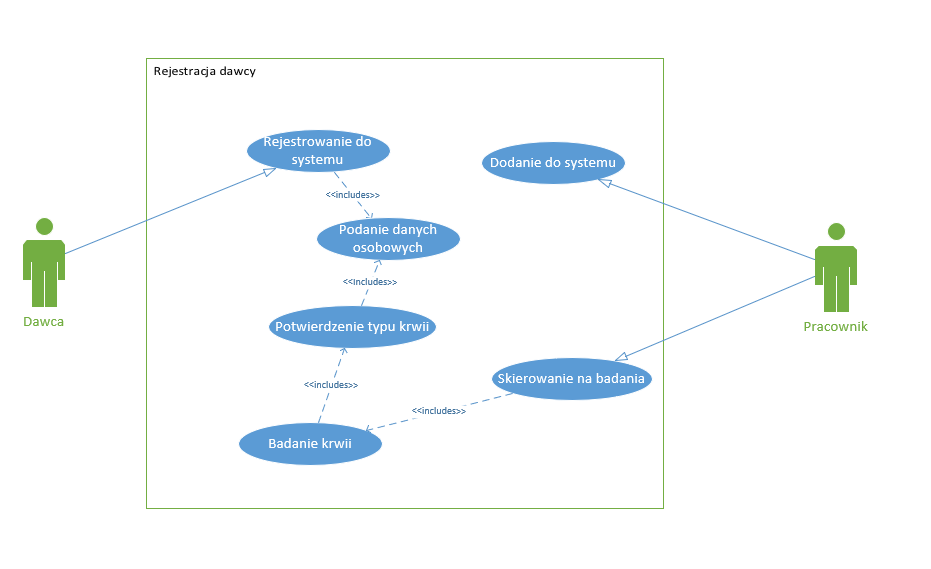
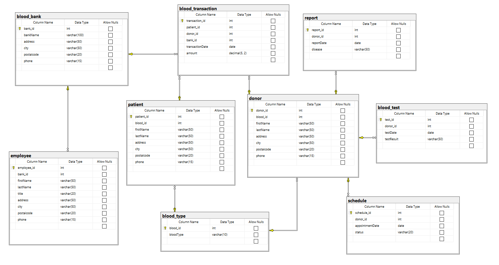
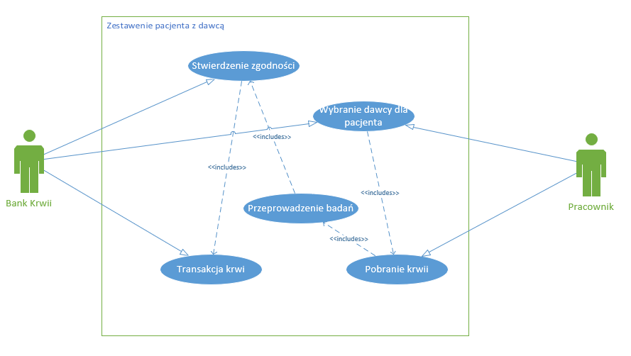
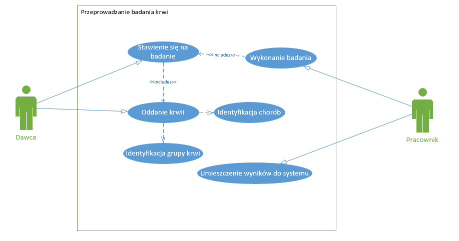
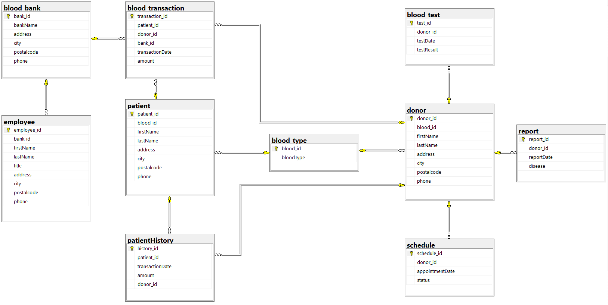

# Blood_bank_database
 

<!-- <style>
 p,li {
    font-size: 12pt;
  }
</style>  -->

<!-- <style>
 pre {
    font-size: 8pt;
  }
</style>  -->


---






**Temat:** System Krwiodawstwa

**Autorzy:** Wiktor Piotrowski, Filip Przepiórka

--- 

# 1.  Zakres i krótki opis Bazy Danych

## Zakres Bazy Danych:
Baza danych zarządzania krwią obejmuje tabele do przechowywania informacji o darczyńcach, 
pacjentach, testach krwi, transakcjach krwi, typach krwi, historii pacjentów, raportach medycznych, 
harmonogramach darczyńców oraz bankach krwi. Jest to centralny punkt przechowywania danych 
związanych z zarządzaniem krwią w celu zapewnienia jej odpowiedniej dystrybucji i monitorowania.

## Opis Bazy Danych:
Baza danych zarządzania krwią składa się z tabel, które przechowują różne typy informacji. 
Relacje między tabelami pozwalają na powiązanie danych darczyńców, pacjentów, testów krwi, 
transakcji krwi, typów krwi, historii pacjentów, raportów medycznych, harmonogramów i banków krwi. 
Tabele są zaprojektowane w sposób, który umożliwia łatwe zarządzanie i dostęp do tych danych.

# 2.	Opis Tabel i Relacji

## Tabela donor:
Przechowuje dane darczyńców.\
Klucz główny: donor_id.\
Kolumny: donor_id, blood_id, firstName, lastName, address, city, postalcode, phone.\
Relacje: Odwołuje się do blood_type poprzez blood_id.

## Tabela patient:
Przechowuje dane pacjentów.\
Klucz główny: patient_id.\
Kolumny: patient_id, blood_id, firstName, lastName, address, city, postalcode, phone.\
Relacje: Odwołuje się do blood_type poprzez blood_id.

## Tabela blood_test:
Przechowuje wyniki testów krwi darczyńców.\
Klucz główny: test_id.\
Kolumny: test_id, donor_id, testDate, testResult.\
Relacje: Odwołuje się do donor poprzez donor_id.

## Tabela blood_transaction:
Przechowuje transakcje krwi między darczyńcami a pacjentami.\
Klucz główny: transaction_id.\
Kolumny: transaction_id, patient_id, donor_id, bank_id, transactionDate, amount.\
Relacje: Odwołuje się do patient poprzez patient_id, do donor poprzez donor_id, do blood_bank poprzez bank_id.

## Tabela blood_type:
Przechowuje typy krwi.\
Klucz główny: blood_id.\
Kolumny: blood_id, bloodType.

## Tabela employee:
Przechowuje dane pracowników banków krwi.\
Klucz główny: employee_id.\
Kolumny: employee_id, bank_id, firstName, lastName, title, address, city, postalcode, phone.\
Relacje: Odwołuje się do blood_bank poprzez bank_id.

## Tabela patientHistory:
Przechowuje historię transakcji krwi pacjentów.\
Klucz główny: history_id.\
Kolumny: history_id, patient_id, transactionDate, amount, donor_id.\
Relacje: Odwołuje się do patient poprzez patient_id, do donor poprzez donor_id.

## Tabela report:
Przechowuje raporty medyczne darczyńców.\
Klucz główny: report_id.\
Kolumny: report_id, donor_id, reportDate, disease.\
Relacje: Odwołuje się do donor poprzez donor_id.

## Tabela schedule:
Przechowuje harmonogramy wizyt darczyńców.\
Klucz główny: schedule_id.\
Kolumny: schedule_id, donor_id, appointmentDate, status.\
Relacje: Odwołuje się do donor poprzez donor_id.

## Tabela blood_bank:
Przechowuje dane banków krwi.\
Klucz główny: bank_id.\
Kolumny: bank_id, bankName, address, city, postalcode, phone.

# 3. Funkcje Bazy Danych
### 1. Przechowywanie danych o darczyńcach i pacjentach:
   - Umożliwia przechowywanie danych osobowych, adresowych i kontaktowych.
### 2. Przechowywanie wyników testów krwi:
   - Pozwala na przechowywanie wyników testów krwi dla darczyńców.
### 3. Rejestrowanie transakcji krwi:
   - Umożliwia rejestrowanie transakcji krwi między darczyńcami a pacjentami, z uwzględnieniem daty i ilości przetoczonej krwi.
### 4. Zarządzanie typami krwi:
   - Umożliwia przechowywanie różnych typów krwi i powiązanie ich z darczyńcami i pacjentami.
### 5. Przechowywanie historii pacjentów:
   - Śledzi historię transakcji krwi dla pacjentów, przechowując daty i ilości przetoczonej krwi oraz informacje o darczyńcach.
### 6. Tworzenie i przechowywanie raportów medycznych:
   - Umożliwia tworzenie raportów medycznych dla darczyńców i przechowywanie informacji o wykrytych chorobach.
### 7. Planowanie harmonogramów darczyńców:
   - Umożliwia planowanie wizyt darczyńców oraz śledzenie statusów tych wizyt.
### 8. Przechowywanie danych pracowników:
   - Umożliwia przechowywanie danych osobowych i kontaktowych pracowników banków krwi.
### 9. Przechowywanie danych banków krwi:
   - Umożliwia przechowywanie danych adresowych i kontaktowych banków krwi.

Relacje między tabelami
- **donor** i **blood_type**: Darczyńcy są powiązani z typami krwi poprzez blood_id.
- **patient** i **blood_type**: Pacjenci są powiązani z typami krwi poprzez blood_id.
- **blood_test** i **donor**: Testy krwi są powiązane z darczyńcami poprzez donor_id.
- **blood_transaction** i **patient**, **donor**, **blood_bank**: Transakcje krwi są powiązane z pacjentami, darczyńcami i bankami krwi.
- **patientHistory** i **patient**, **donor**: Historia pacjentów jest powiązana z pacjentami i darczyńcami.
- **report** i **donor**: Raporty medyczne są powiązane z darczyńcami.
- **schedule** i **donor**: Harmonogramy są powiązane z darczyńcami.
- **employee** i **blood_bank**: Pracownicy są powiązani z bankami krwi.
- **blood_bank** i **blood_transaction**, **employee**: Banki krwi są powiązane z transakcjami krwi i pracownikami.

#### Ta baza danych jest fundamentem dla systemu zarządzania krwią, umożliwiając efektywne zarządzanie danymi związanymi z darowiznami, przechowywaniem, testowaniem i dystrybucją krwi.

# 4.	Schemat bazy danych



# 5.	Implementacja

## Kod poleceń DDL

* **Kod tworzenia tabeli "blood_bank"**
```sql
create table dbo.blood_bank
(
    bank_id    int         not null
        constraint PK__blood_ba__4076F70352A54453
            primary key,
    bankName   varchar(50) not null,
    address    varchar(50) not null,
    city       varchar(50) not null,
    postalcode varchar(20) not null,
    phone      varchar(15) not null
)
go
```
* **Kod tworzenia tabeli "blood_test"**
```sql
create table dbo.blood_test
(
    test_id    int         not null
        constraint PK__blood_te__F3FF1C0280C5ABE3
            primary key,
    donor_id   int         not null
        constraint FK__blood_tes__donor__5B438874
            references dbo.donor,
    testDate   date        not null,
    testResult varchar(50) not null
)
go
```
* **Kod tworzenia tabeli "blood_transaction"**
```sql
create table dbo.blood_transaction
(
    transaction_id  int           not null
        constraint PK__blood_tr__85C600AFD3A56DFD
            primary key,
    patient_id      int           not null
        constraint FK__blood_tra__patie__567ED357
            references dbo.patient,
    donor_id        int           not null
        constraint FK__blood_tra__donor__5772F790
            references dbo.donor,
    bank_id         int           not null
        constraint FK__blood_tra__bank___58671BC9
            references dbo.blood_bank,
    transactionDate date          not null,
    amount          decimal(5, 2) not null
)
go
```
* **Kod tworzenia tabeli "blood_type"**
```sql
create table dbo.blood_type
(
    blood_id  int         not null
        primary key,
    bloodType varchar(10) not null
)
go
```
* **Kod tworzenia tabeli "donor"**
```sql
create table dbo.donor
(
    donor_id   int         not null
        constraint PK__donor__8B5B10F9C1F527BD
            primary key,
    blood_id   int         not null
        constraint FK__donor__blood_id__4EDDB18F
            references dbo.blood_type,
    firstName  varchar(50) not null,
    lastName   varchar(50) not null,
    address    varchar(50) not null,
    city       varchar(50) not null,
    postalcode varchar(20) not null,
    phone      varchar(15) not null
)
go
```
* **Kod tworzenia tabeli "employee"**
```sql
create table dbo.employee
(
    employee_id int         not null
        constraint PK__employee__C52E0BA8BFAE2015
            primary key,
    bank_id     int         not null
        constraint FK__employee__bank_i__5E1FF51F
            references dbo.blood_bank,
    firstName   varchar(50) not null,
    lastName    varchar(50) not null,
    title       varchar(20) not null,
    address     varchar(50) not null,
    city        varchar(50) not null,
    postalcode  varchar(20) not null,
    phone       varchar(15) not null
)
go
```
* **Kod tworzenia tabeli "patient"**
```sql
create table dbo.patient
(
    patient_id int           not null
        constraint PK__patient__4D5CE476A2E6A73A
            primary key,
    blood_id   int           not null
        constraint FK__patient__blood_i__4C0144E4
            references dbo.blood_type,
    firstName  varchar(50)   not null,
    lastName   varchar(50)   not null,
    address    varchar(50)   not null,
    city       varchar(50)   not null,
    postalcode varchar(20)   not null,
    phone      varbinary(15) not null
)
go
```
* **Kod tworzenia tabeli "patientHistory"**
```sql
create table dbo.patientHistory
(
    history_id      int           not null
        constraint PK__patientH__096AA2E93881455D
            primary key,
    patient_id      int           not null
        constraint FK__patientHi__patie__63D8CE75
            references dbo.patient,
    transactionDate date          not null,
    amount          decimal(5, 2) not null,
    donor_id        int           not null
        constraint FK__patientHi__donor__64CCF2AE
            references dbo.donor
)
go
```
* **Kod tworzenia tabeli "report"**
```sql
create table dbo.report
(
    report_id  int         not null
        constraint PK__report__779B7C58014D5059
            primary key,
    donor_id   int         not null
        constraint FK__report__donor_id__51BA1E3A
            references dbo.donor,
    reportDate date        not null,
    disease    varchar(50) not null
)
go
```
* **Kod tworzenia tabeli "schedule"**
```sql
create table dbo.schedule
(
    schedule_id     int         not null
        constraint PK__schedule__C46A8A6F5969F7F9
            primary key,
    donor_id        int         not null
        constraint FK__schedule__donor___60FC61CA
            references dbo.donor,
    appointmentDate date        not null,
    status          varchar(20) not null
)
go
```
